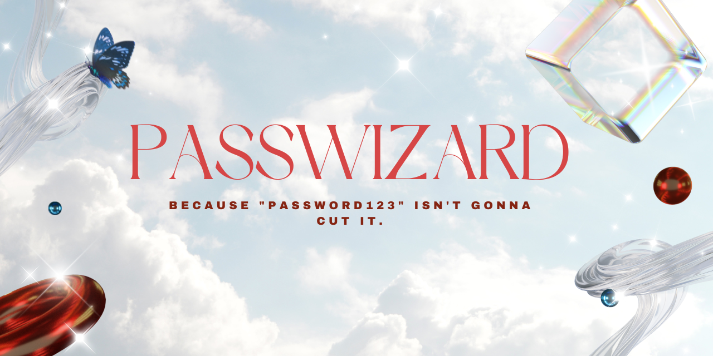

  

<h1 align="center">✨ PASSWIZARD ✨</h1>

  <b>Because "password123" isn't gonna cut it.</b> 
  <a href="https://itsjasperfernandez.github.io/passwizard/">🌐 Live Demo</a> •
  <a href="https://github.com/itsjasperfernandez/passwizard">📁 Repository</a>

---

## 🧩 About

**PASSWIZARD** is an interactive password generator that mixes security with style.  
Generate strong, chaotic, and borderline magical passwords with options for uppercase, numbers, symbols, and length — all wrapped up in a slick animated UI.

---

## ✨ Features

- 🔐 Instant secure password generation  
- 🎛️ Adjustable length (4 – 32 chars)  
- 🔠 Toggles for uppercase, numbers, and symbols  
- 📋 One-click copy to clipboard  
- 💪 Password strength meter with emoji reactions  
- 🌙 Hidden dark-mode toggle  
- 🕹️ Konami-code party mode (yes, really)  
- 🎮 Combo counter and bonus animations  

---

## 🧠 Tech Stack

| Category | Tools |
|-----------|--------|
| **Frontend** | React + Vite |
| **Styling** | TailwindCSS |
| **Icons** | Lucide React |
| **Hosting** | GitHub Pages |

---

## 🚀 Run Locally
# Clone the repo
git clone https://github.com/itsjasperfernandez/passwizard.git

# Enter folder
cd passwizard

# Install dependencies
npm install

# Run dev server
npm run dev
